# MEI Finance

🚧 Projeto em Desenvolvimento 🚧

O MEI Finance é uma plataforma moderna e intuitiva de controle financeiro projetada especificamente para o Microempreendedor Individual (MEI) brasileiro. O sistema resolve uma das principais dificuldades do microempreendedor: a separação clara e organizada entre as finanças pessoais (Pessoa Física - PF) e profissionais (Pessoa Jurídica - PJ).

Este projeto foi construído seguindo a metodologia **Spec-Driven Development (SDD)**, garantindo que o desenvolvimento seja sempre orientado por especificações e contratos técnicos claros e validados.

---

## Demonstração Visual das Telas

Para economizar espaço e facilitar a comparação visual, as capturas de tela abaixo apresentam as versões em **Tema Claro** (esquerda) e **Tema Escuro** (direita) de cada seção principal da plataforma.

### 1. Página Inicial (Portal de Acesso)

Página de apresentação da plataforma, com design moderno, clean e atrativo, destacando os propósitos do sistema e fornecendo opções de acesso rápido para login e cadastro.

<table>
  <tr>
    <td width="50%" align="center">
      <b>Tema Claro</b><br/>
      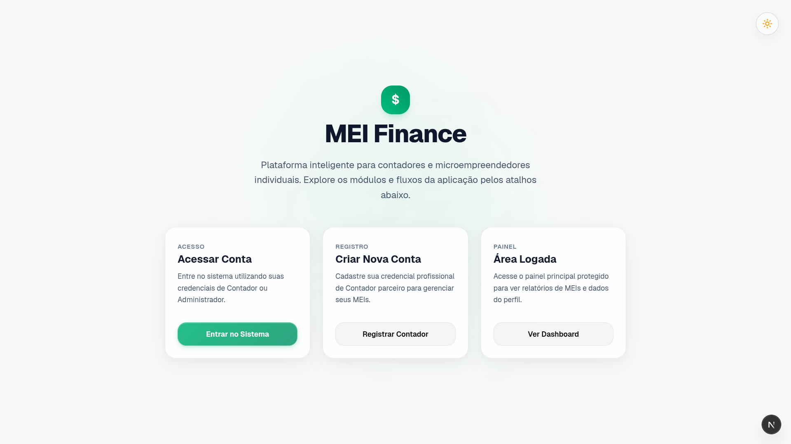
    </td>
    <td width="50%" align="center">
      <b>Tema Escuro</b><br/>
      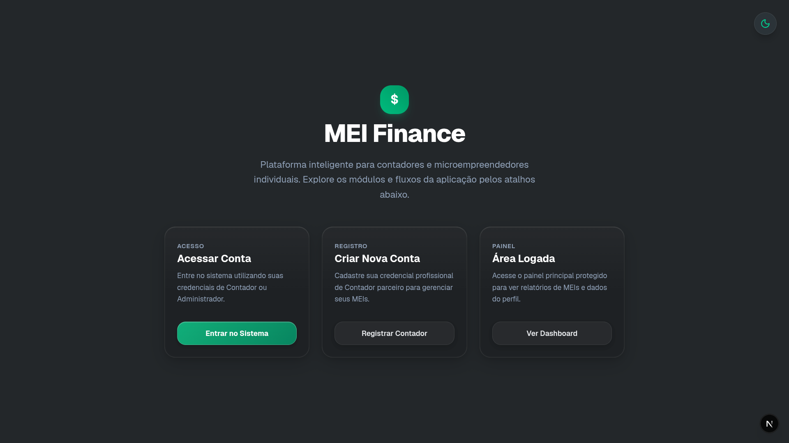
    </td>
  </tr>
</table>

---

### 2. Autenticação (Login)

Tela de login segura para acesso ao painel administrativo. Apresenta feedback visual claro em português em caso de erros de validação ou credenciais inválidas.

<table>
  <tr>
    <td width="50%" align="center">
      <b>Tema Claro</b><br/>
      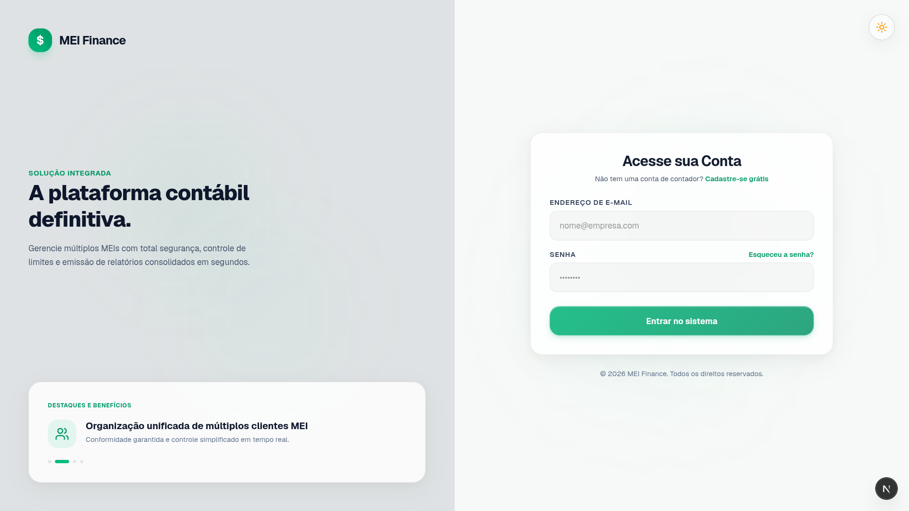
    </td>
    <td width="50%" align="center">
      <b>Tema Escuro</b><br/>
      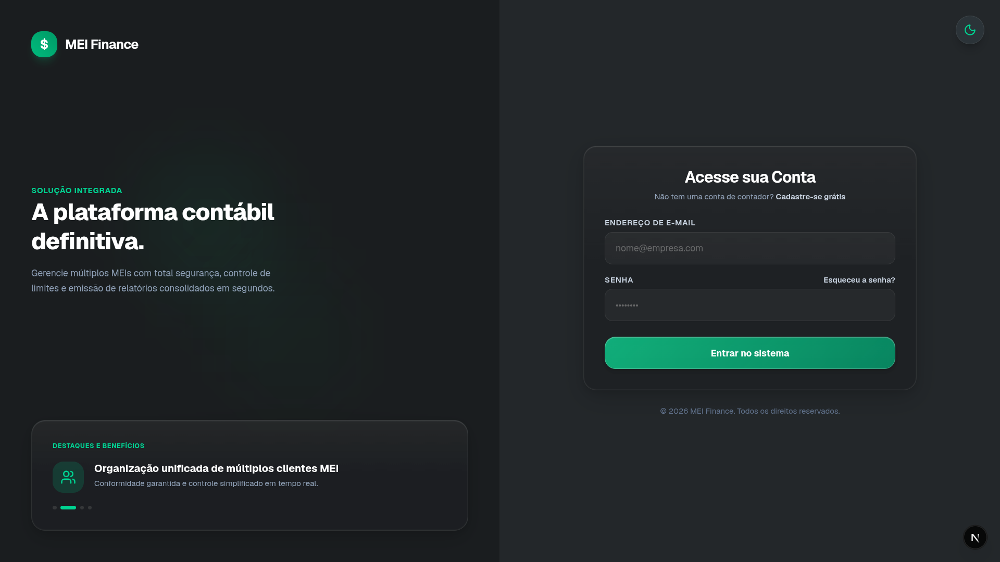
    </td>
  </tr>
</table>

---

### 3. Cadastro (Primeiro Acesso)

Formulário de cadastro de novos usuários (como administradores ou contadores). Inclui validações em tempo real em português e campos específicos para registro do CRC e nome do escritório de contabilidade.

<table>
  <tr>
    <td width="50%" align="center">
      <b>Tema Claro</b><br/>
      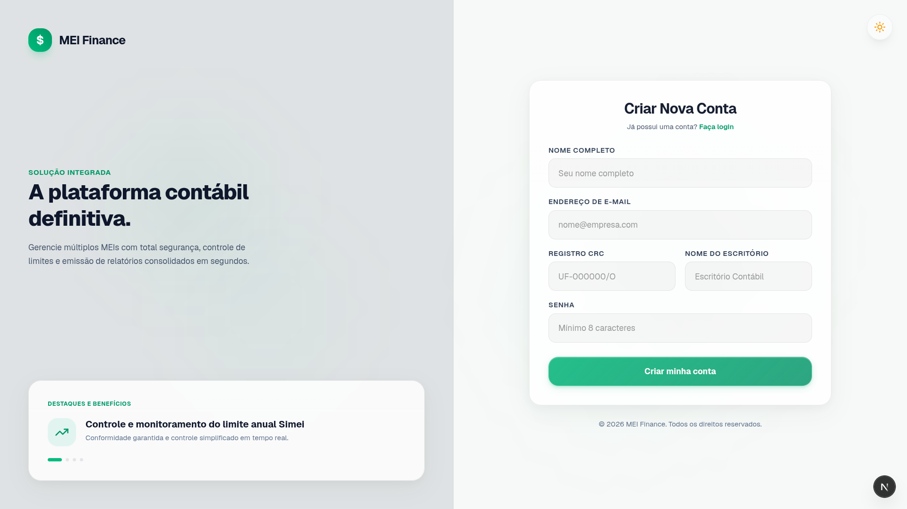
    </td>
    <td width="50%" align="center">
      <b>Tema Escuro</b><br/>
      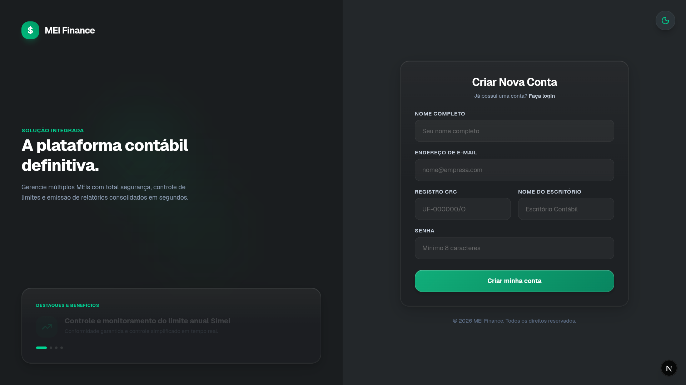
    </td>
  </tr>
</table>

---

### 4. Dashboard Principal (Página Inicial Logada)

O dashboard do usuário exibe informações básicas de perfil e o status administrativo da conta autenticada, servindo como ponto central de navegação rápida por meio do menu inferior (dock).

<table>
  <tr>
    <td width="50%" align="center">
      <b>Tema Claro</b><br/>
      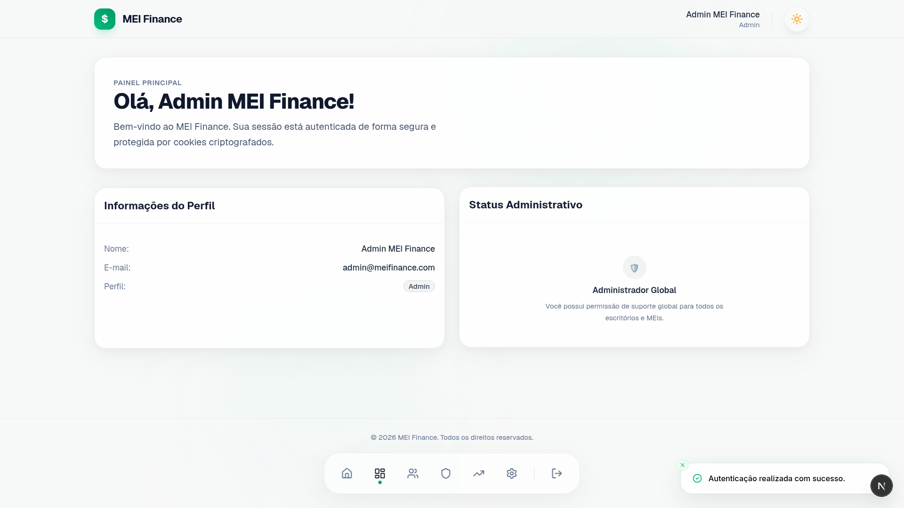
    </td>
    <td width="50%" align="center">
      <b>Tema Escuro</b><br/>
      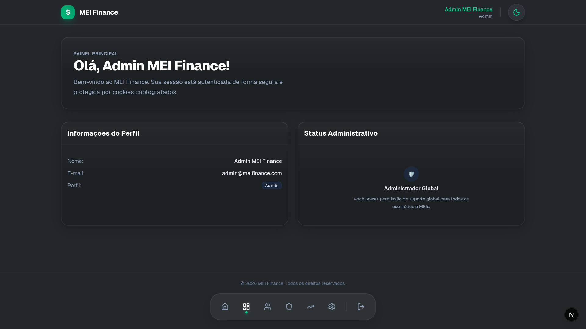
    </td>
  </tr>
</table>

---

### 5. Controle de Usuários (Painel Administrativo)

Listagem administrativa de usuários cadastrados no sistema. Possui recursos avançados de pesquisa em tempo real por nome ou e-mail, paginação integrada e atalhos rápidos para criar, editar ou remover registros.

<table>
  <tr>
    <td width="50%" align="center">
      <b>Tema Claro</b><br/>
      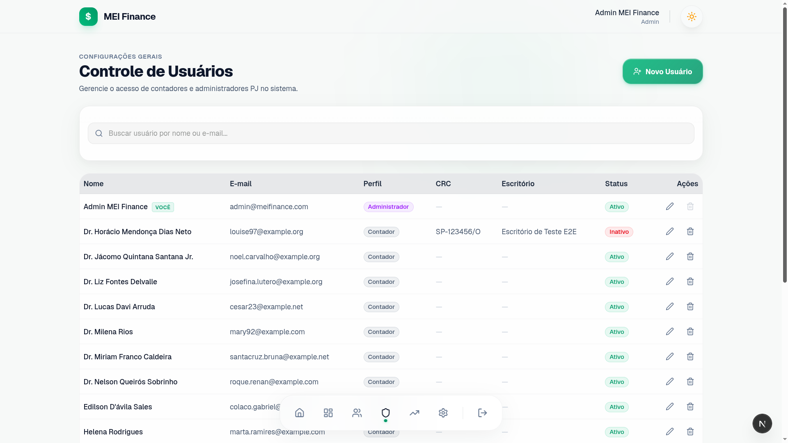
    </td>
    <td width="50%" align="center">
      <b>Tema Escuro</b><br/>
      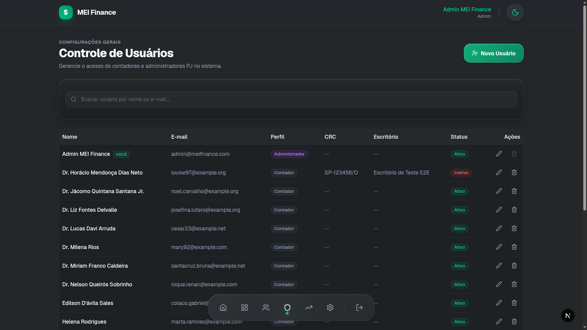
    </td>
  </tr>
</table>

---

### 6. Modais de Operações Administrativas

Para garantir uma experiência de usuário fluida e evitar redirecionamentos desnecessários, todas as operações administrativas (criar, editar e excluir) são realizadas por meio de modais interativos integrados.

#### A. Criação de Usuário (Novo Usuário)
<table>
  <tr>
    <td width="50%" align="center">
      <b>Tema Claro</b><br/>
      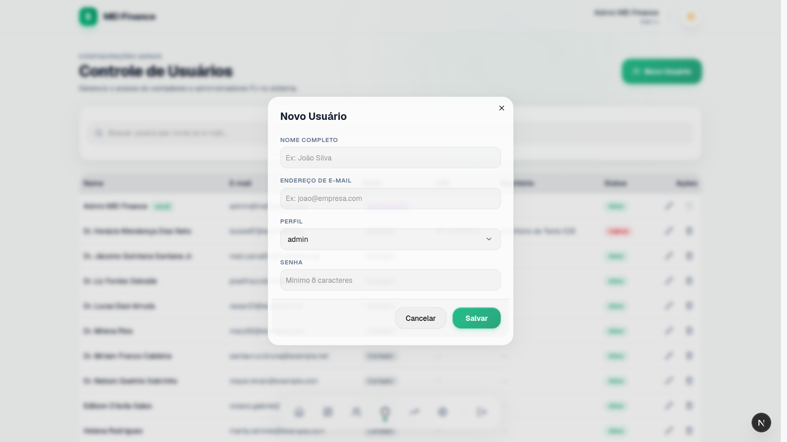
    </td>
    <td width="50%" align="center">
      <b>Tema Escuro</b><br/>
      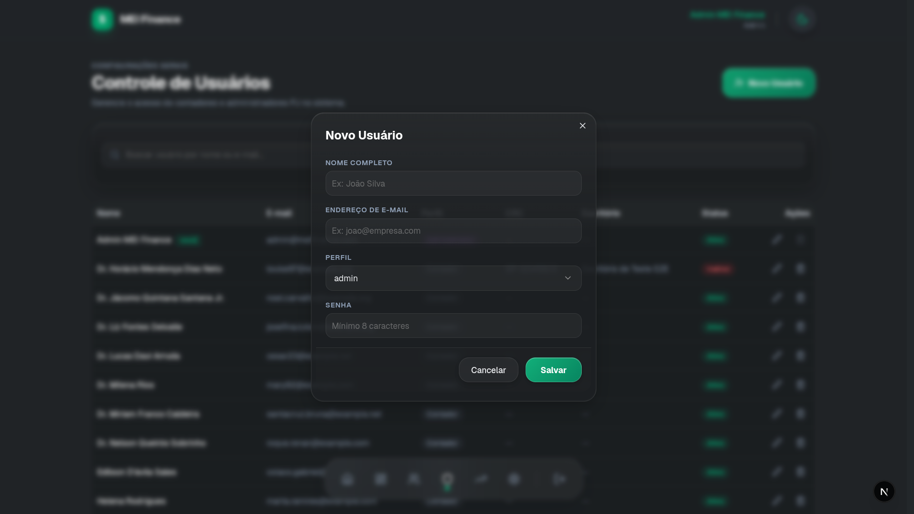
    </td>
  </tr>
</table>

#### B. Edição de Usuário (Editar Usuário)
<table>
  <tr>
    <td width="50%" align="center">
      <b>Tema Claro</b><br/>
      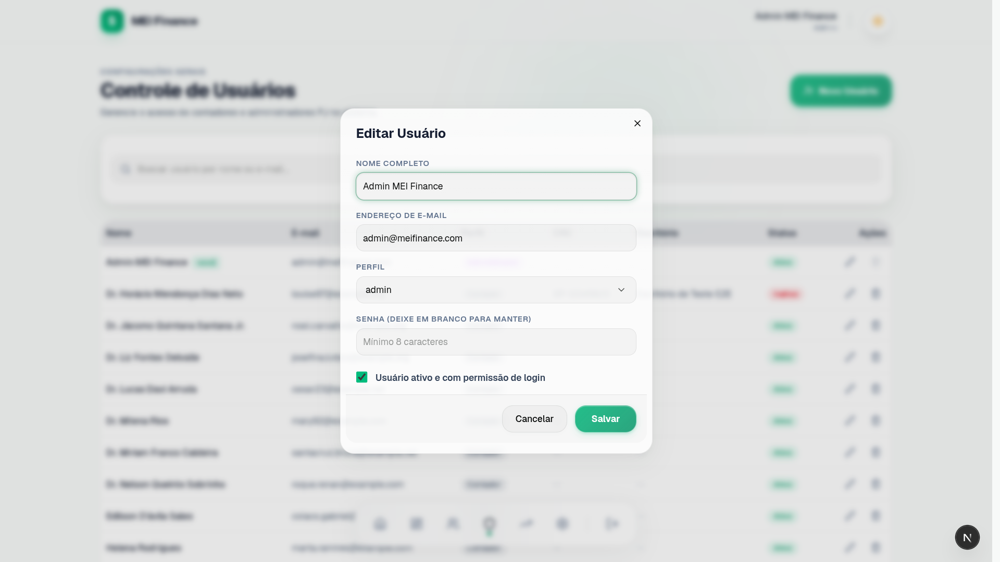
    </td>
    <td width="50%" align="center">
      <b>Tema Escuro</b><br/>
      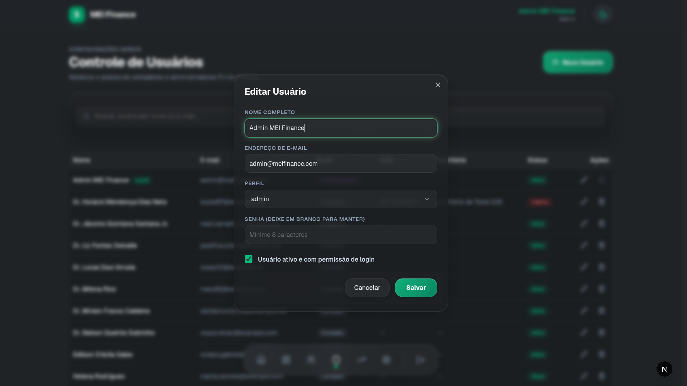
    </td>
  </tr>
</table>

#### C. Confirmação de Exclusão (Excluir Usuário)
<table>
  <tr>
    <td width="50%" align="center">
      <b>Tema Claro</b><br/>
      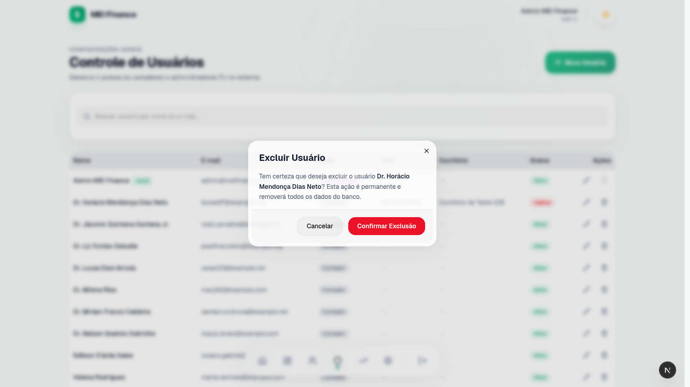
    </td>
    <td width="50%" align="center">
      <b>Tema Escuro</b><br/>
      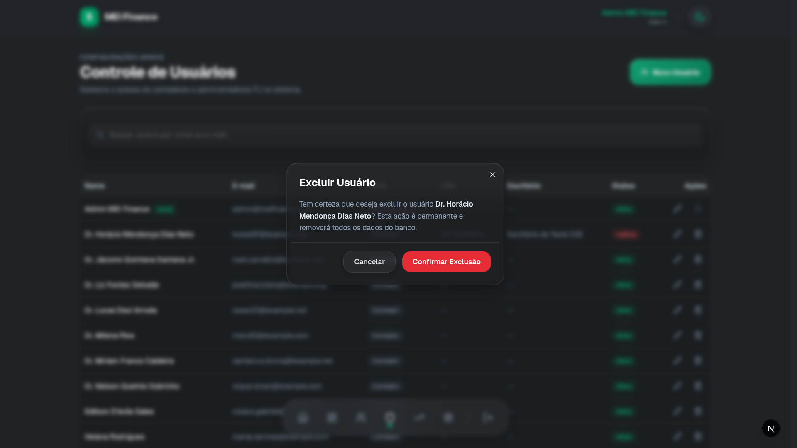
    </td>
  </tr>
</table>

---

### 7. Documentação Automatizada da API (Scramble)

A API possui documentação interativa integrada ao Scramble, com suporte completo a autenticação Bearer Token para testes diretos de endpoints protegidos no próprio navegador.

<p align="center">
  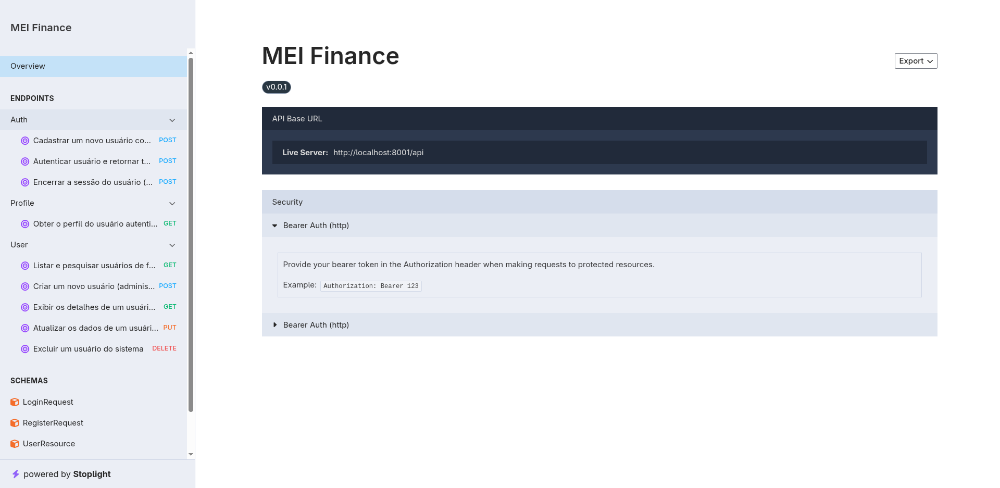
</p>

---

## Stack Tecnológica

### Backend (Laravel API)
*   **Linguagem:** PHP 8.3+
*   **Framework:** Laravel 13.8+
*   **Segurança:** Laravel Sanctum (autenticação por Bearer Token)
*   **Banco de Dados:** PostgreSQL 16 (rodando via container Docker)
*   **Documentação:** Dedoc Scramble (documentação OpenAPI automática baseada em PHPDocs)
*   **Testes:** Pest PHP (testes de integração e unitários de alta velocidade)

### Frontend (Next.js App)
*   **Estrutura:** Next.js 16.2.9 (com App Router)
*   **Linguagem:** TypeScript
*   **Estilização:** Tailwind CSS v4, Vanilla CSS (vidro translúcido / glassmorphism)
*   **Gerenciador de Estado de Autenticação:** NextAuth.js
*   **Componentes Headless:** Radix UI / @base-ui/react
*   **Ícones:** Lucide Icons

---

## Como Executar o Projeto Localmente

### Pré-requisitos
*   **Docker** e **Docker Compose** instalados na máquina.
*   **PHP 8.3+** e **Composer** configurados.
*   **Node.js 20+** e **npm** instalados.

---

### Passo 1: Inicializar o Banco de Dados (PostgreSQL)

Na raiz do projeto (onde está localizado o arquivo `docker-compose.yml`), execute o comando para iniciar o banco de dados em segundo plano:

```bash
docker compose up -d
```

---

### Passo 2: Configurar e Executar o Backend (Laravel)

1.  Acesse o diretório do backend:
    ```bash
    cd laravel
    ```

2.  Instale as dependências do PHP:
    ```bash
    composer install
    ```

3.  Crie o arquivo de ambiente local copiando o exemplo:
    ```bash
    cp .env.example .env
    ```

4.  Gere a chave da aplicação:
    ```bash
    php artisan key:generate
    ```

5.  Execute as migrations e popule o banco de dados com dados iniciais (seeders):
    ```bash
    php artisan migrate --seed
    ```

6.  Inicie o servidor de desenvolvimento do Laravel:
    ```bash
    php artisan serve --port=8001
    ```
    *A API backend estará disponível em `http://localhost:8001/api/v1` e a documentação interativa em `http://localhost:8001/docs/api`.*

---

### Passo 3: Configurar e Executar o Frontend (Next.js)

1.  Abra um novo terminal e acesse a pasta do frontend:
    ```bash
    cd nextjs
    ```

2.  Instale os pacotes npm:
    ```bash
    npm install
    ```

3.  Crie o arquivo de ambiente para o Next.js:
    ```bash
    cp .env.example .env.local
    ```

4.  Rode a aplicação em modo de desenvolvimento:
    ```bash
    npm run dev
    ```
    *O painel do Next.js estará acessível em `http://localhost:3000`.*

---

## Credenciais Padrão de Acesso (Seed)

Após rodar o comando `php artisan db:seed`, as seguintes contas de teste estarão disponíveis para login:

*   **Administrador**:
    *   **E-mail:** `admin@meifinance.com`
    *   **Senha:** `admin123`
*   **Contador (Comum)**:
    *   **E-mail:** `contador@meifinance.com`
    *   **Senha:** `contador123`

---

## Estrutura do Desenvolvimento Orientado por Especificações (SDD)

Todas as definições de escopo, contratos de rotas de API, diagramas de dados e checklists de verificação podem ser encontrados no diretório `/specs`:
*   **Autenticação:** [specs/001-autenticacao/spec.md](specs/001-autenticacao/spec.md)
*   **Controle de Usuários:** [specs/003-controle-usuarios/spec.md](specs/003-controle-usuarios/spec.md)
