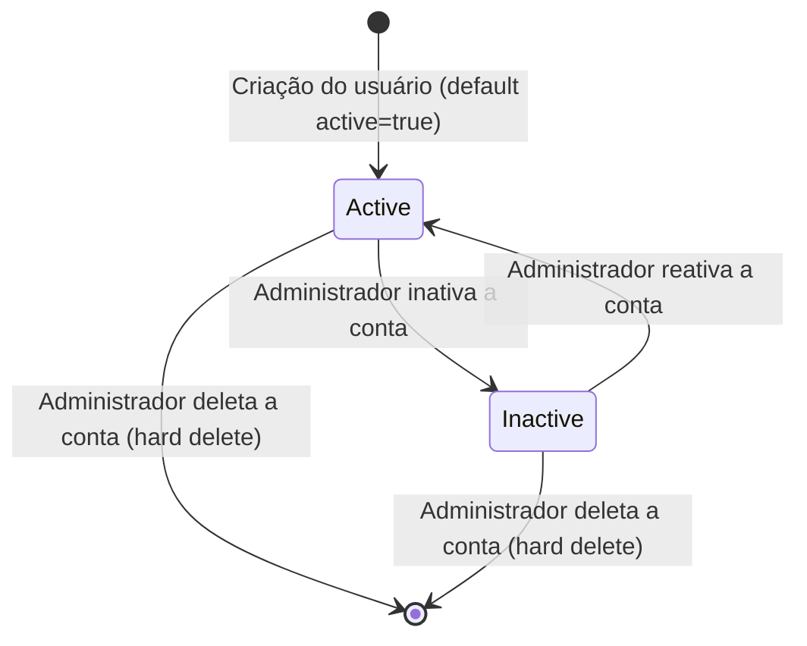

# Data Model: Controle de Usuários (Administrador)

Este documento define os modelos de dados, validações e diagramas lógicos para a funcionalidade de gerenciamento de usuários.

---

## 1. Entidade: Usuário (User)

No backend Laravel, a entidade `User` gerencia tanto administradores quanto contadores, diferenciando-os pela coluna `role`.

### Campos e Tipagem (PostgreSQL)

| Coluna | Tipo SQL | Nullable? | Descrição |
| :--- | :--- | :--- | :--- |
| `id` | `BIGINT (PK)` | Não | Identificador único incremental |
| `name` | `VARCHAR(255)` | Não | Nome completo do usuário |
| `email` | `VARCHAR(255)` | Não | E-mail exclusivo de acesso (Unique index) |
| `password` | `VARCHAR(255)` | Não | Hash da senha de acesso |
| `role` | `VARCHAR(50)` | Não | Perfil de permissão: `admin` ou `accountant` |
| `crc` | `VARCHAR(50)` | Sim | Registro profissional do contador (UF-000000/O) |
| `office_name`| `VARCHAR(255)` | Sim | Nome do escritório do contador |
| `active` | `BOOLEAN` | Não | Status de ativação da conta (Default: `true`) |
| `created_at` | `TIMESTAMP` | Sim | Data de criação do registro |
| `updated_at` | `TIMESTAMP` | Sim | Data de modificação do registro |

---

## 2. Validações e Regras de Transição

### Regras do Backend (Laravel Form Requests)

*   **Criação:**
    *   `name`: Obrigatório, string, no máximo 255 caracteres.
    *   `email`: Obrigatório, string, formato de e-mail válido, único na tabela `users`.
    *   `password`: Obrigatório, string, mínimo de 8 caracteres.
    *   `role`: Obrigatório, valor entre `admin` e `accountant`.
    *   `crc`: Obrigatório se `role === 'accountant'`, string, deve seguir a formatação regulamentar do CRC.
    *   `office_name`: Obrigatório se `role === 'accountant'`, string, no máximo 255 caracteres.
*   **Edição (Atualização):**
    *   `name`: Obrigatório, string, no máximo 255 caracteres.
    *   `email`: Obrigatório, string, formato de e-mail, único na tabela `users` ignorando o ID atual.
    *   `password`: Opcional, mínimo de 8 caracteres se preenchido.
    *   `role`: Obrigatório, valor entre `admin` e `accountant`.
    *   `crc`/`office_name`: Segue a mesma condicional do cadastro. Se a role for alterada de `accountant` para `admin`, o service do Laravel definirá estes valores como `null`.
*   **Exclusão:**
    *   O ID da request não pode ser igual ao ID do usuário autenticado. Caso contrário, lança erro `422 Unprocessable Content` impedindo a auto-exclusão.

---

## 3. Estados do Usuário

